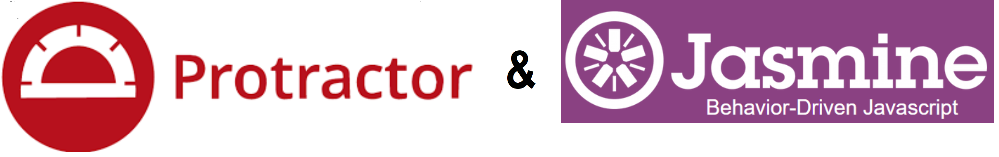
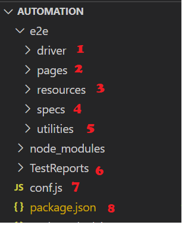

<p align="center">

</p>

# Behavior Driven-Protractor-Jasmine in Javascript

The purpose of the project is to display Keyword driven framework for web applications using SeleniumLibrary in Robotframework.

## Tools & Technologies

* Automation Tools: Protractor (5.4.2)-Jasmine (4.2.1)
* Project Setup: Suites & Spec
* Framework Design Pattern: Page Object Model
* Test Execution Report: Jasmine HTML Reporter
* Test Execution Mode: Sequence
* Browser: Chrome (86.0.4240.75) & Firefox (66.0.3)
* Screenshot: Both In built capability & manual
* Wait: Explicit waits w/ Async &await
* Assertions: Hard & Soft
* SCM: AzureDevops & Github
* Build Tool: Jenkins & AzureDevOps

## Project Structure

<p align="center">
<br />
</p>

* Drivers:-
In this folder we will keep the chrome driver executable to launch the chrome browser. 
  
* Pages :-
In this folder we will have page locators’ files and one Helper Method file.

	+ Page Locators: In protractor, we will create the Page Object Modal class to develop and store the re-
usable methods. These methods are nothing, but Page ObjectsPage Objects are nothing, but web elements present on the web page like Buttons, links, tabs, text bars. We have to create page object class for every page present in the application if the application is single page application (spa) we haveto create page object classes for each tab. Page Object class contains all the page object(web elements) for a particular page. For every page present application, we have to write the Page Object class.

	+ Page Method: In this file we will create all the helper methods which will help in accessing the page
objects this is done in order to keep the code clean and readable and to achieve the reusability.

* Resources :-
Under this resources folder we will create testData.json which will hold data for any test cases , this to done to keep code clean and ensure code is readable also centralized the data incase if get changed we will have to change just here.

* Specs/Scripts:-
In this folder we will have folder each with respective testing for example Functional folder will have functional test scripts, Regression will have regression-based scripts, and finally smoke will have smoke test case scripts. 

* Utilities::-
Under this folder we have custom libraries or helper functions to help in various operations like synchronization and last but no least setting waits.

* Package.json:-
This file contains the setyp of how to run scripts and as well all packages required in order to run test cases are added in it for protability. This allows anyone new to quickly
get started on the framework using simple command like 'npm install' 

* Conf.js:-
This file contains configuration of framework like link to test scripts, prepartion of test reports etc.

# How to Setup & Run the project:-
These are ways:


* Download the code from repository and run following command. It will download all libraries automatically
```npm
   npm install
```
* Run Single Test Spec:- You want to run LocationTestsSpec.js test class which is under regression-tests directory you will run using following command. Ensure under specs in conf.js
all test specs are commented out only LocationTestsSpec.js is un-commented. 
```npm
   npm test
```
* Run All Test Suite:- You want to run all test classes which is under regression-tests directory you will run using following command. Berfore running the command ensure in package.json file you have set protractor conf.js --suite smoke or protractor conf.js --suite regression
```npm
   npm regression-test
```
OR
```npm
   npm smoke-test
```


